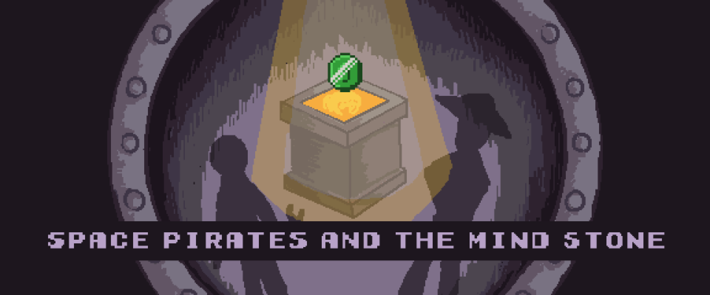

# Space Pirates and the Mind Stone

This is a game made in Godot as part of the [GMTK Game Jam 2023](https://itch.io/jam/gmtk-2023), where we had 48 hours to make a game based on the theme "Roles Reversed".

Made as a team of 3 - [@alifeee] (myself), [@FreyaCon] and [@dicemaster5]

You can play the game on: <https://alifeee.itch.io/space-pirates-and-the-mind-stone> !!!



[@alifeee]: https://github.com/alifeee
[@FreyaCon]: https://github.com/FreyaCon
[@dicemaster5]: https://github.com/dicemaster5

## Development

| Requirement | Version |
| ---- | ------- |
| Godot | 4.1.0 |

Open the project in Godot and run using F5.

### Exporting

To export, use Godot's export, in Project > Export > Export All... > Release.
This will place the built game in the `Export` folder.

### Serving locally

```bash
cd .\Export
python serve.py --root .
```

By default, it attempts to automatically open the page in browser, but this breaks. Manually open <http://localhost:8060>.
